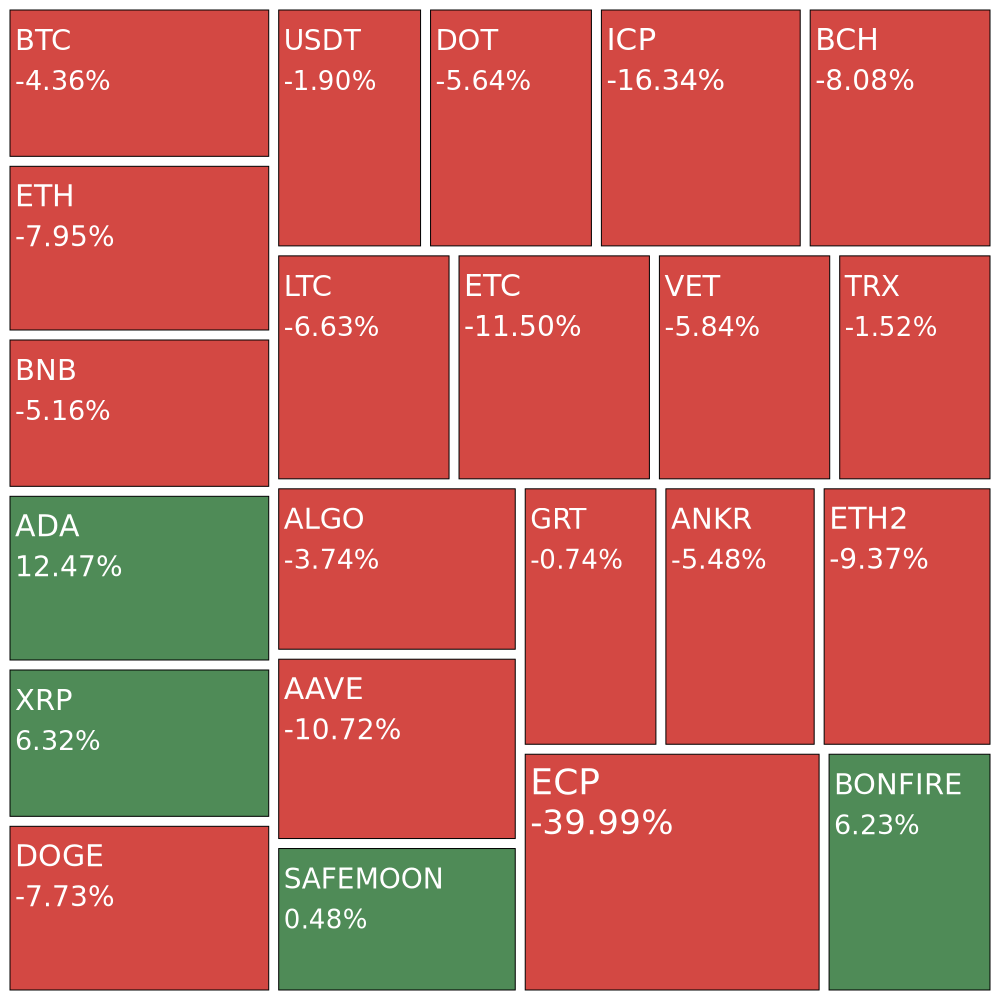

# Crypto Reporter

Cryptocurrency reporter depicting gains and losses of selected coins in a graph. 

Slack and web client included.

Demo: [https://cryptoreporter-web.herokuapp.com/](https://cryptoreporter-web.herokuapp.com/)

Crypto Reporter will render a D3 tree map depicting gains and losses of your requested coin ticker symbols. The sizes of the boxes depict the size of the gain or loss over a 24 hour period.

## Clients

* [Web documentation](./web-server/README.md)
* [Slack documentation](./slack-client/README.md)

## Contributions

Contributions are always welcome. 

Would love assistance improving the graph and making the Slack client easier to set up. 

## Donations 

| Coin | Address                                                    |
| ---- | ---------------------------------------------------------- |
| BTC  | 1NjGKNoVNo8n6TujBU4WWEavw2k8QqHZJa                         |
| ETH  | 0xB4c270C298789e2138f11752e74715F852D2c867                 |
| ADA  | addr1v9skh5uvzme33pevctnfl57qdvv54azwn6wme84l75qj6ggq6dual |
| ANKR | 0xB2770e95aE4C6e16B4C307867Fb2D3bE1Dbb309f                 |