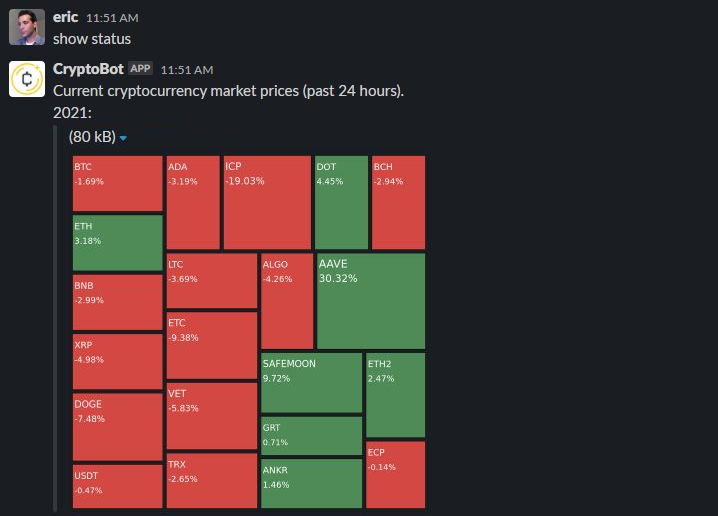

# Crypto Reporter: Web Server

Web-based cryptocurrency reporter depicting gains and losses of selected coins in a graph.



This is the [Slack](https://slack.com/) client for Crypto Reporter. It will render a D3 tree map depicting gains and losses of your requested coin ticker symbols upon request. The sizes of the boxes depict the size of the gain or loss over a 24 hour period.

## File Structure

```
|-- index.js                          # entry point
|-- lib/                              # library support files
|   |-- messageBroker.js              # Event-based Slack client wrapper
|   |-- reportManager.js              # generates a report in PNG format to broadcast to a selected channel
```

## Setup

```
npm install
```

## Configuration

In your .env file or environment variables:

```
CHANNEL_NAME=#cryptocurrencies        # Channel name where bot will live (optional)
BOT_NAME=CryptoBot                    # Name of your bot (optional)
SLACK_TOKEN                           # Your Slack token
SLACK_SIGNING_SECRET                  # Your Slack signing secret
REPORT_URL                            # Report URL from the Crypto Reporter web module
```

See this guide for creating your own Slack bot: [https://slack.com/help/articles/115005265703-Create-a-bot-for-your-workspace](https://slack.com/help/articles/115005265703-Create-a-bot-for-your-workspace)

Ensure that you have the following to activate your bot at [https://api.slack.com/apps/](https://api.slack.com/apps/):
* Activate Incoming Webhooks
  * Create a Webhook for your channel
* Create an OAuth scope under OAuth & Permissions
  * Your Bot User OAuth Token will be used in the above configuration for SLACK_TOKEN
  * Sample permissions include:
    * `channels:history`
    * `chat:write`
    * `incoming-webhook`

## Running

```
npm start
```

## Contributions

Contributions are always welcome. <3

## Donations 

| Coin | Address                                                    |
| ---- | ---------------------------------------------------------- |
| BTC  | 1NjGKNoVNo8n6TujBU4WWEavw2k8QqHZJa                         |
| ETH  | 0xB4c270C298789e2138f11752e74715F852D2c867                 |
| ADA  | addr1v9skh5uvzme33pevctnfl57qdvv54azwn6wme84l75qj6ggq6dual |
| ANKR | 0xB2770e95aE4C6e16B4C307867Fb2D3bE1Dbb309f                 |